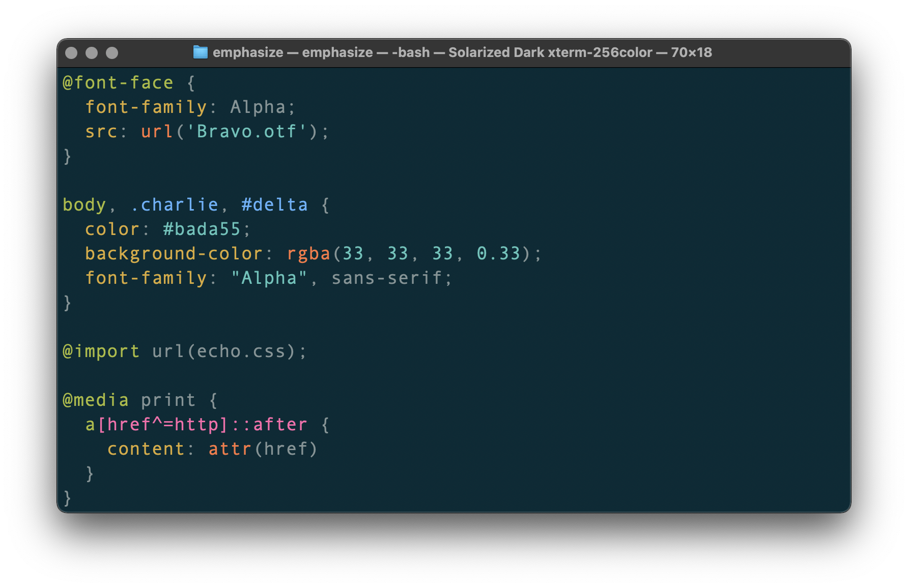

# emphasize

[![Build][build-badge]][build]
[![Coverage][coverage-badge]][coverage]
[![Downloads][downloads-badge]][downloads]
[![Size][size-badge]][size]

ANSI syntax highlighting for your terminal.

## Contents

*   [What is this?](#what-is-this)
*   [When should I use this?](#when-should-i-use-this)
*   [Install](#install)
*   [Use](#use)
*   [API](#api)
    *   [`emphasize.highlight(language, value[, sheet])`](#emphasizehighlightlanguage-value-sheet)
    *   [`emphasize.highlightAuto(value[, sheet | options])`](#emphasizehighlightautovalue-sheet--options)
    *   [`emphasize.registerLanguage(language, syntax)`](#emphasizeregisterlanguagelanguage-syntax)
    *   [`emphasize.registerAlias(language, alias)`](#emphasizeregisteraliaslanguage-alias)
    *   [`emphasize.registered(aliasOrlanguage)`](#emphasizeregisteredaliasorlanguage)
    *   [`emphasize.listLanguages()`](#emphasizelistlanguages)
    *   [`Sheet`](#sheet)
*   [Types](#types)
*   [Compatibility](#compatibility)
*   [Security](#security)
*   [Contribute](#contribute)
*   [License](#license)

## What is this?

This package wraps [highlight.js][highlight] through [`lowlight`][lowlight] to
output ANSI syntax highlighting instead of HTML.

`highlight.js`, through lowlight, supports 190+ programming languages.
Supporting all of them requires a lot of code.
That’s why there are three entry points for `emphasize`:

*   `lib/core.js` — 0 languages
*   `lib/common.js` (default) — 37 languages
*   `lib/all.js` — 192 languages

Bundled, minified, and gzipped, those are roughly 9.7 kB, 47 kB, and 290 kB.

## When should I use this?

This package is useful when you want to display code on a terminal.

## Install

This package is [ESM only][esm].
In Node.js (version 14.14+, 16.0+), install with [npm][]:

```sh
npm install emphasize
```

In Deno with [`esm.sh`][esmsh]:

```js
import {emphasize} from 'https://esm.sh/emphasize@6'
```

In browsers with [`esm.sh`][esmsh]:

```html
<script type="module">
  import {emphasize} from 'https://esm.sh/emphasize@6?bundle'
</script>
```

## Use

Say `example.css` looks as follows:

```css
@font-face {
  font-family: Alpha;
  src: url('Bravo.otf');
}

body, .charlie, #delta {
  color: #bada55;
  background-color: rgba(33, 33, 33, 0.33);
  font-family: "Alpha", sans-serif;
}

@import url(echo.css);

@media print {
  a[href^=http]::after {
    content: attr(href)
  }
}
```

…and `example.js` contains the following:

```js
import fs from 'node:fs/promises'
import {emphasize} from 'emphasize'

const doc = String(await fs.readFile('example.css'))

const output = emphasize.highlightAuto(doc).value

console.log(output)
```

…now running `node example.js` yields:

```txt
\x1B[32m@font-face\x1B[39m {
  \x1B[33mfont-family\x1B[39m: Alpha;
  \x1B[33msrc\x1B[39m: \x1B[31murl\x1B[39m(\x1B[36m'Bravo.otf'\x1B[39m);
}

\x1B[32mbody\x1B[39m, \x1B[34m.charlie\x1B[39m, \x1B[34m#delta\x1B[39m {
  \x1B[33mcolor\x1B[39m: \x1B[36m#bada55\x1B[39m;
  \x1B[33mbackground-color\x1B[39m: \x1B[31mrgba\x1B[39m(\x1B[36m33\x1B[39m, \x1B[36m33\x1B[39m, \x1B[36m33\x1B[39m, \x1B[36m0.33\x1B[39m);
  \x1B[33mfont-family\x1B[39m: \x1B[36m"Alpha"\x1B[39m, sans-serif;
}

\x1B[32m@import\x1B[39m url(echo.css);

\x1B[32m@media\x1B[39m print {
  \x1B[32ma\x1B[39m\x1B[35m[href^=http]\x1B[39m\x1B[35m::after\x1B[39m {
    \x1B[33mcontent\x1B[39m: \x1B[31mattr\x1B[39m(href)
  }
}
```

…which looks as follows:



## API

This package exports the identifier `emphasize`.
There is no default export.

### `emphasize.highlight(language, value[, sheet])`

Highlight `value` (code) as `language` (name).

###### Parameters

*   `language` (`string`)
    — programming language [name][names]
*   `value` (`string`)
    — code to highlight
*   `sheet` ([`Sheet?`][sheet], optional)
    — configure the theme

###### Returns

`value` with ANSI sequences (`string`).

### `emphasize.highlightAuto(value[, sheet | options])`

Highlight `value` (code) and guess its programming language.

###### Parameters

*   `value` (`string`)
    — code to highlight
*   `options.sheet` ([`Sheet?`][sheet], optional)
    — configure the theme
*   `options.subset` (`Array<string>`, default: all registered language names)
    — list of allowed languages

###### Returns

`value` with ANSI sequences (`string`).

### `emphasize.registerLanguage(language, syntax)`

Register a language.

###### Parameters

*   `language` (`string`)
    — programming language name
*   `syntax` ([`HighlightSyntax`][syntax])
    — `highlight.js` syntax

###### Note

`highlight.js` operates as a singleton: once you register a language in one
place, it’ll be available everywhere.

### `emphasize.registerAlias(language, alias)`

Register aliases for already registered languages.

###### Signatures

*   `registerAlias(language, alias|list)`
*   `registerAlias(aliases)`

###### Parameters

*   `language` (`string`)
    — programming language [name][names]
*   `alias` (`string`)
    — new aliases for the programming language
*   `list` (`Array<string>`)
    — list of aliases
*   `aliases` (`Record<language, alias|list>`)
    — map of `language`s to `alias`es or `list`s

### `emphasize.registered(aliasOrlanguage)`

Check whether an `alias` or `language` is registered.

###### Parameters

*   `aliasOrlanguage` (`string`)
    — [name][names] of a registered language or alias

###### Returns

Whether `aliasOrlanguage` is registered (`boolean`).

### `emphasize.listLanguages()`

List registered languages.

###### Returns

Names of registered language (`Array<string>`).

### `Sheet`

A sheet is an object mapping [`highlight.js` classes][classes] to functions.
The `hljs-` prefix must not be used in those classes.
The “descendant selector” (a space) is supported.

Those functions receive a value (`string`), which they should wrap in ANSI
sequences and return.
For convenience, [chalk’s chaining of styles][styles] is suggested.

An abbreviated example is as follows:

```js
{
  'comment': chalk.gray,
  'meta meta-string': chalk.cyan,
  'meta keyword': chalk.magenta,
  'emphasis': chalk.italic,
  'strong': chalk.bold,
  'formula': chalk.inverse
}
```

## Types

This package is fully typed with [TypeScript][].
It exports the additional types `Sheet` and `AutoOptions`.

## Compatibility

This package is at least compatible with all maintained versions of Node.js.
As of now, that is Node.js 14.14+ and 16.0+.
It also works in Deno and modern browsers.

## Security

This package is safe.

## Contribute

Yes please!
See [How to Contribute to Open Source][contribute].

## License

[MIT][license] © [Titus Wormer][author]

<!-- Definitions -->

[build-badge]: https://github.com/wooorm/emphasize/workflows/main/badge.svg

[build]: https://github.com/wooorm/emphasize/actions

[coverage-badge]: https://img.shields.io/codecov/c/github/wooorm/emphasize.svg

[coverage]: https://codecov.io/github/wooorm/emphasize

[downloads-badge]: https://img.shields.io/npm/dm/emphasize.svg

[downloads]: https://www.npmjs.com/package/emphasize

[size-badge]: https://img.shields.io/bundlephobia/minzip/emphasize.svg

[size]: https://bundlephobia.com/result?p=emphasize

[npm]: https://docs.npmjs.com/cli/install

[esm]: https://gist.github.com/sindresorhus/a39789f98801d908bbc7ff3ecc99d99c

[esmsh]: https://esm.sh

[typescript]: https://www.typescriptlang.org

[contribute]: https://opensource.guide/how-to-contribute/

[license]: license

[author]: https://wooorm.com

[sheet]: #sheet

[highlight]: https://github.com/highlightjs/highlight.js

[syntax]: https://github.com/highlightjs/highlight.js/blob/main/docs/language-guide.rst

[lowlight]: https://github.com/wooorm/lowlight

[names]: https://github.com/highlightjs/highlight.js/blob/main/SUPPORTED_LANGUAGES.md

[classes]: https://highlightjs.readthedocs.io/en/latest/css-classes-reference.html

[styles]: https://github.com/chalk/chalk#styles
